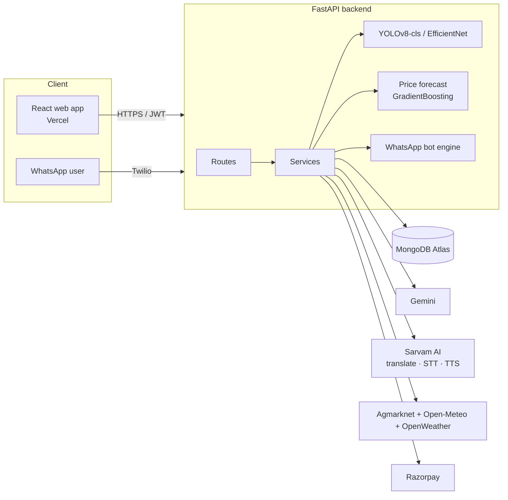

<div align="center">

# AgriPulse

### *KisanMitra AI* — the AI farming companion that speaks your language

Scan a sick leaf · forecast mandi prices · read the sky · rent a tractor · check a farm loan
— by typing, by voice, or on WhatsApp.


</div>

> *AgriPulse* and *KisanMitra AI* are the same product.

---

## Contents

1. [What it does](#what-it-does)
2. [The experience](#the-experience)
3. [Architecture](#architecture)
4. [Feature details](#feature-details)
5. [Tech stack](#tech-stack)
6. [Project structure](#project-structure)
7. [Quick start](#quick-start)
8. [Configuration](#configuration)
9. [Training the disease model](#training-the-disease-model)
10. [WhatsApp bot](#whatsapp-bot)
11. [API overview](#api-overview)
12. [Testing](#testing)
13. [Deployment](#deployment)
14. [Security and honesty notes](#security-and-honesty-notes)
15. [Known limits](#known-limits)

---

## What it does

| Feature | In one line |
|---|---|
| **Disease detection** | Photo of a leaf → disease name, confidence, medicine, cost, weather-aware advice, in the farmer's language. |
| **Mandi price forecast** | Today's price plus a 4-week forecast, the best week to sell, and price alerts on WhatsApp. |
| **Weather advisory** | Live weather for a district turned into plain farming advice. |
| **Equipment marketplace** | Rent tractors, harvesters and drones within 10 km, by the day or the hour, paid by UPI. |
| **Loan advisor** | Kisan Credit Card (KCC) eligibility, estimated limit, missing documents, nearest bank / CSC. |
| **AI assistant** | Ask any farming question; answers use your district and your latest diagnosis. |
| **Voice first, 14 languages** | Speak instead of type on every screen; answers are spoken back. |
| **WhatsApp bot** | Everything above from a chat: photos, voice notes, shared location. |

Supported languages: English, हिन्दी, ಕನ್ನಡ, తెలుగు, தமிழ், മലയാളം, मराठी, বাংলা, ગુજરાતી, ਪੰਜਾਬੀ, ଓଡ଼ିଆ, اردو
(right-to-left), অসমীয়া, भोजपुरी.

## The experience

1. **Splash** — a branded opening animation.
2. **Story page** — a scrollable, motion-driven page that explains what AgriPulse can do (public, no login).
3. **Hidden menu** (three lines, top left) — a full-width curtain menu with every tool and the language chooser.
4. **Profile** (top right) — a circular reveal with the farmer's details, edit profile, theme and logout.
5. **Login on demand** — phone + OTP. Picking a tool as a guest plays a page transition into the login,
   then lands on that tool. First-time users answer a 3-step onboarding once.
6. **Tools** — dashboard, disease scan, prices, weather, marketplace, assistant, loan advisor, history.
   Light and dark themes, mobile-first layout, reduced-motion friendly.

## Architecture



## Feature details

### Disease detection
- **YOLOv8-cls** (transfer-learned from `yolov8n.pt`) trained on **71 classes**, **94.5 % top-1 accuracy** on
  6,529 held-out images; **EfficientNet-B0** is the automatic fallback if the YOLO weights are missing.
- Below a confidence threshold the answer is "Uncertain" with retake tips instead of a wrong guess.
- Treatment for classes the medicine table does not know is generated by Gemini and translated.
- On WhatsApp the farmer can confirm or correct the result; corrections are kept for retraining.

### Mandi price forecast
- Five years of Agmarknet history per crop and market, plus rainfall / temperature from Open-Meteo.
- One gradient-boosting model per horizon (7 / 14 / 21 / 28 days), back-tested against a straight-line
  baseline; reports its own average error and falls back to the linear model when history is short.
- **Best time to sell**, confidence band, and alerts (rise, fall, best time) delivered in-app and on WhatsApp.

### Equipment marketplace
- Owners list machines (tractor, harvester, rotavator, cultivator, seeder, sprayer, drone, sprayer drone, trailer).
- **GPS radius search** (5–50 km), distance on every card, "live" badge while a position is being reported
  (from the owner's phone or a GPS tracker using a per-machine key).
- **Day or hourly booking** with overlap protection, booked-slot display and an availability toggle.
- **Razorpay** checkout (UPI first), server-side signature verification, payment fetch, idempotent webhook,
  automatic lifecycle: *Pending → Confirmed → Active → Completed / Expired*.

### Loan advisor (KCC)
- Four-step form (farm & land, crops, soil & loans, documents) → score out of 100, verdict, estimated limit
  breakdown (cultivation, post-harvest, maintenance, existing loans), collateral-free amount, weather-risk
  score, missing documents, next steps, nearest bank / Common Service Centre with directions, printable report.
- The explanation is written by Gemini in the farmer's language and can be read aloud.
- DigiLocker is a **mock adapter** and the scale-of-finance table and bank list are **samples** — see
  [`docs/REPLACE_DEMO_DATA.md`](docs/REPLACE_DEMO_DATA.md).

### Voice and languages
- **Sarvam AI** first: translation (13 languages), speech-to-text with automatic language detection, and
  text-to-speech voices; **Gemini** and the browser's own voices are the fallbacks (Bhojpuri goes through Gemini).
- Microphone button on every input, a global **"speak a command"** button ("show weather in Mysuru"),
  and a **Listen** button on answers.
- The interface labels are hand-translated for all 14 languages; other text is translated on demand by the server.

### WhatsApp bot
Diagnose a leaf photo, weather, prices with forecast and alerts, equipment near a shared location, the loan
check, bookings, a 7 a.m. morning message, voice notes in and out. Signature-verified webhook, duplicate
protection, flood limit, STOP / START opt-out. Full guide: [`docs/WHATSAPP_BOT.md`](docs/WHATSAPP_BOT.md).

### Accounts
Phone + OTP login with JWT sessions. Onboarding data (name, date of birth, state, district, language, role)
is stored in MongoDB and restored on the next login. *(The OTP is a fixed demo code — see
[security notes](#security-and-honesty-notes).)*

## Tech stack

| Layer | Technology |
|---|---|
| Frontend | React 19 (Create React App), Framer Motion, Lucide icons, custom CSS design system (light / dark) |
| Backend | Python 3.13, FastAPI, Uvicorn, Pydantic |
| Database | MongoDB Atlas (PyMongo); `mongomock` in tests |
| ML | Ultralytics YOLOv8-cls, PyTorch / torchvision (EfficientNet-B0), scikit-learn (gradient boosting) |
| AI services | Google Gemini, Sarvam AI (translate / STT / TTS) |
| Data | Agmarknet (data.gov.in), Open-Meteo archive, OpenWeather |
| Payments | Razorpay (test mode) |
| Messaging | Twilio WhatsApp |
| Hosting | Vercel (frontend), Docker on Hugging Face Spaces / Render (backend), Atlas (data) |

## Project structure

```
AgriPulse/
├─ app/
│  ├─ main.py                 FastAPI app, lifespan tasks, CORS, static media
│  ├─ routes/                 auth, disease, price, weather, equipment, loan, voice, i18n, chat, alerts, whatsapp
│  ├─ services/               forecast, price history, weather, rentals, payments, loan advisor, Sarvam, translation …
│  ├─ ai/
│  │  ├─ classifier/          YOLOv8-cls + EfficientNet backends (shared contract)
│  │  ├─ agent/ tools/        Gemini agent, medicine table, tool planner
│  │  ├─ models/              trained weights + metrics / report
│  │  └─ training/            dataset preparation
│  ├─ whatsapp/               bot engine, natural-language parsing, per-feature handlers, Twilio I/O
│  ├─ db/                     Mongo client, counters, indexes
│  └─ data/                   states / districts, KCC rules, bank directory (samples)
├─ kisanmitra-frontend/
│  └─ src/
│     ├─ Splash.js · Landing.js · Site.js · AuthFlow.js     opening, story page, menu / profile frame, login
│     ├─ pages/                                             dashboard, disease, price, weather, marketplace …
│     ├─ ui/                                                design kit, icons, SVG art, notifications
│     ├─ i18n/                                              14 language files
│     └─ styles/                                            tokens, components, pages, site
├─ scripts/                   dataset preparation, model evaluation, UI-translation generator
├─ tests/                     470+ backend tests (in-memory MongoDB, no network)
├─ docs/                      WhatsApp bot, replacing demo data, deployment
├─ train_yolo_classifier.py   YOLOv8-cls training
├─ Dockerfile · render.yaml   container deployment
└─ requirements.txt
```

## Quick start

**Prerequisites:** Python 3.13, Node 20+, a MongoDB Atlas database, FFmpeg (voice), and the API keys you want to use.

```powershell
# 1. Backend
python -m venv venv
venv\Scripts\activate
pip install -r requirements.txt
copy .env.example .env               # fill in the keys (see Configuration)
python -m uvicorn app.main:app --reload --port 5556

# 2. Frontend (second terminal)
cd kisanmitra-frontend
npm install
npm start                            # http://localhost:5555
```

The frontend reads `REACT_APP_API_URL` (default `http://127.0.0.1:5556`). FFmpeg on Windows:
`winget install Gyan.FFmpeg`. Open the app, tap **Get started**, use any 10-digit number and OTP **123456**.

## Configuration

Copy `.env.example` to `.env`. The minimum is `MONGODB_URI` and `JWT_SECRET`; a missing key switches only that
feature off or makes it fall back.

| Variable | Purpose |
|---|---|
| `MONGODB_URI`, `MONGODB_DB` | Atlas connection |
| `JWT_SECRET` | signs login tokens |
| `GEMINI_API_KEY` | assistant, treatments, explanations, translation fallback |
| `SARVAM_API_KEY` | translation, speech-to-text, text-to-speech |
| `AGMARKNET_API_KEY` | mandi prices (data.gov.in) |
| `WEATHER_API_KEY` | OpenWeather |
| `RAZORPAY_KEY_ID`, `RAZORPAY_KEY_SECRET`, `RAZORPAY_WEBHOOK_SECRET` | payments |
| `TWILIO_ACCOUNT_SID`, `TWILIO_AUTH_TOKEN`, `TWILIO_WHATSAPP_FROM` | WhatsApp |
| `PUBLIC_BASE_URL` | public URL of the backend (webhook signature, voice replies) |
| `CORS_ORIGINS`, `FRONTEND_URL` | allowed web origin(s) and the link sent on WhatsApp |
| `DISEASE_MODEL`, `CONFIDENCE_THRESHOLD` | `yolo` / `efficientnet`, and the "Uncertain" cut-off |
| `FAKE_AUTH` | `true` = demo OTP `123456`; `false` disables login until a real SMS provider exists |
| `DIGILOCKER_PROVIDER` | `mock` (default) or `real` |
| `DIGEST_HOUR` | hour of the WhatsApp morning message |

## Training the disease model

Dataset: one folder per class named `Crop___disease` under `datasets/leaf_disease_detection_dataset/`
(71 classes, ~116k images; not in git).

```powershell
python scripts/prepare_dataset.py          # balanced train / val split + report
python train_yolo_classifier.py            # trains yolov8n-cls, saves app/ai/models/yolov8_disease.pt
python train_yolo_classifier.py --resume   # continue an interrupted run
python scripts/evaluate_model.py           # per-class accuracy, confusions, recommended threshold
```

Classes are capped at 500 training images so a CPU run stays affordable. The backbone of `yolov8n.pt` is
transferred into a classification model. Current result: **94.49 % top-1** over 6,529 validation images.

## WhatsApp bot

```
phone → WhatsApp → Twilio → your server → /whatsapp → bot → reply
```

Send a leaf photo, `weather Mysuru`, `price tomato`, a voice note, a shared location, `loan`, `bookings`,
`language kannada`, `menu`, `STOP`. Setup (Twilio sandbox, tunnel or hosted URL, webhook) and limits:
[`docs/WHATSAPP_BOT.md`](docs/WHATSAPP_BOT.md).

## API overview

Interactive docs at `/docs` (Swagger) when the backend is running. Main groups:

| Group | Endpoints (examples) |
|---|---|
| Auth | `POST /auth/send-otp`, `POST /auth/verify-otp`, `GET /auth/me`, `PUT /auth/profile`, `GET /auth/regions` |
| Disease | `POST /detect-disease`, `GET/DELETE /predictions` |
| Prices | `GET /predict-price`, `POST/GET/DELETE /alerts`, `GET /notifications` |
| Weather | `GET /weather` |
| Marketplace | `GET/POST /equipment`, `PATCH /equipment/{id}/location`, `POST /rent-equipment`, `POST /create-payment-order`, `POST /verify-payment`, `POST /razorpay-webhook`, `GET /rentals`, `POST /tracker/update` |
| Loan | `GET/POST /loan/profile`, `POST /loan/digilocker/fetch`, `POST /loan/report`, `GET /loan/nearby` |
| Voice / i18n | `POST /voice/transcribe`, `/voice/speak`, `/voice/command`, `POST /i18n/translate` |
| Assistant | `POST /ai-chat` |
| WhatsApp | `POST /whatsapp` |
| Ops | `GET /health`, `GET /dashboard-stats` |

## Testing

```powershell
pip install -r requirements-dev.txt
pytest                                       # backend: in-memory MongoDB, no network
cd kisanmitra-frontend
npm test -- --watchAll=false                 # frontend: 35 tests
```

`scripts/manual_check_*.py` call live services and are run by hand.

## Deployment

- **Frontend → Vercel:** import the repository with **Root Directory** `kisanmitra-frontend`, set
  `REACT_APP_API_URL` to the backend URL.
- **Backend → Docker** (Hugging Face Spaces, Render, or any container host): the included `Dockerfile` installs
  FFmpeg and curl. PyTorch needs about 1 GB of RAM, so very small free tiers cannot run leaf diagnosis.
- **Database → MongoDB Atlas** (allow the host's IPs in Network Access).
- After deploying, set `CORS_ORIGINS`, `FRONTEND_URL`, `PUBLIC_BASE_URL`, and point the Twilio and Razorpay
  webhooks at the backend URL.


## Security and honesty notes

- **Demo login:** with `FAKE_AUTH=true` anyone who knows a phone number can log in as it (OTP is always
  `123456`). Fine for a demo; connect a real SMS OTP provider and set `FAKE_AUTH=false` before real users.
- **Secrets** live only in `.env` / the host's dashboard and are never committed; API keys are masked in logs.
- **Payments** are verified server-side (signature + payment fetch) and the webhook is idempotent; use Razorpay
  test keys until fully tested.
- **WhatsApp** requests must carry Twilio's signature; duplicates and floods are rejected.
- Photos sent on WhatsApp are deleted after diagnosis unless the farmer corrects the result.

## Known limits

- DigiLocker is a mock; KCC scale-of-finance values and the bank / CSC list are illustrative samples.
- Price forecasts are statistical estimates, not guarantees; the KCC report is advisory only, not a bank decision.
- The Twilio sandbox only reaches phones that joined it and only within 24 hours of their last message.
- Live GPS tracker hardware is not bundled: the owner's phone (or a device with a key) posts the position.
- Most page text outside the navigation is English; the assistant, advice and voice replies follow the chosen language.
- Rental times use server-local wall-clock time.

---

<div align="center">

Built for farmers.

</div>
